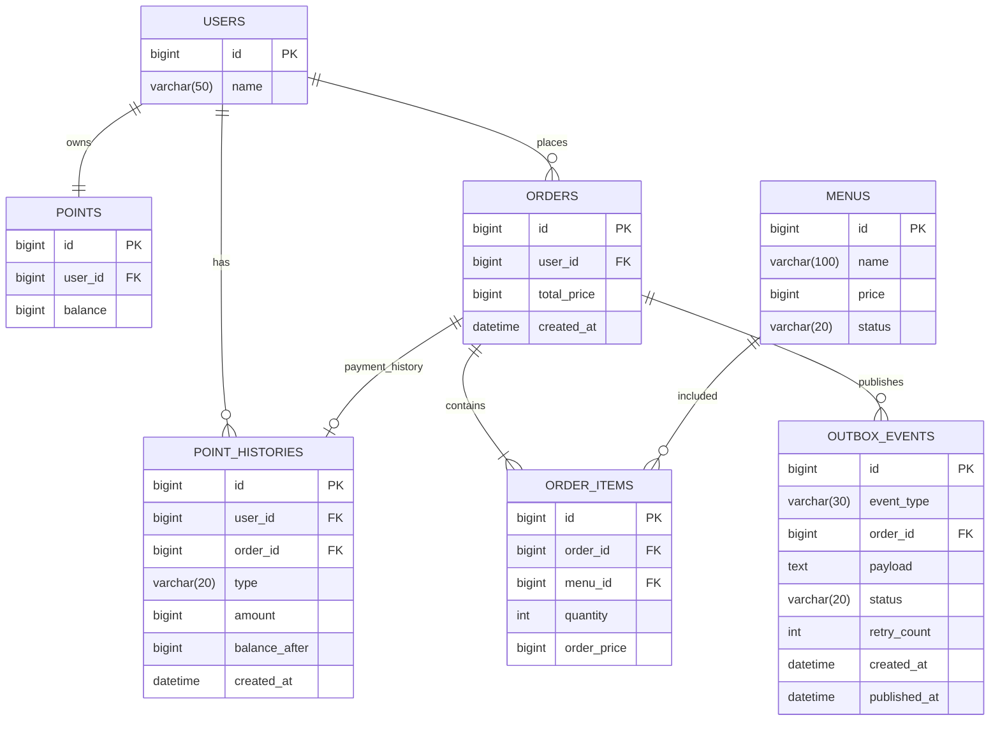

# ☕ Coffee Order System

## 1. 프로젝트 소개

포인트를 충전하여 커피를 주문하고, 최근 7일간의 주문 데이터를 기반으로 인기 메뉴를 조회할 수 있는 커피 주문 시스템입니다.

주문이 완료되면 사용자 식별값, 주문 ID, 주문 상세 품목, 결제 금액을 Outbox 테이블에 저장하고, 트랜잭션 커밋 이후 외부 데이터 수집 Mock API로 전송합니다.

---

## 2. 요구사항 분석

### 커피 메뉴 목록 조회

- 메뉴 ID, 이름, 가격 조회
- 판매 가능한 메뉴 목록 제공

### 포인트 충전

- 사용자 식별값과 충전 금액 입력
- 충전 후 잔액 증가
- 충전 이력 저장

### 커피 주문 및 결제

- 사용자 식별값과 주문할 메뉴 목록 입력
- 포인트 차감
- 주문 생성
- 주문 상세 품목 저장
- 포인트 사용 이력 저장
- 주문 완료 후 Outbox 이벤트 저장
- 트랜잭션 커밋 이후 외부 Mock API로 주문 정보 전송

### 인기 메뉴 조회

- 최근 7일간 주문 상세 품목 기준
- 메뉴별 판매 수량 집계
- 상위 3개 메뉴 조회
- 동일 판매 수량일 경우 메뉴 ID 오름차순 정렬

---

## 3. 기술 스택

| 분야               | 기술                     |
|------------------|------------------------|
| Language         | Java 17                |
| Framework        | Spring Boot            |
| ORM              | Spring Data JPA        |
| Database         | MySQL                  |
| Cache            | Redis                  |
| Build            | Gradle                 |
| Test             | JUnit5, Testcontainers |
| Performance Test | K6                     |
| Container        | Docker Compose         |

---

## 4. 문제 해결 전략

### 4.1 동시성 제어

동일 사용자가 동시에 포인트를 충전하거나 여러 주문을 요청하면 포인트가 중복 계산될 수 있습니다.

이를 방지하기 위해 **DB 비관적 락** 을 적용하여 동일 사용자의 포인트 row를 하나의 트랜잭션만 수정하도록 설계했습니다.

비관적 락은 포인트를 보유한 사용자 row에만 적용하며, 서로 다른 사용자의 주문과 충전은 동시에 처리될 수 있습니다.

#### 선택 이유

- 데이터 정합성 보장
- 동일 사용자 포인트 row에 대한 동시 수정 방지
- 현재 프로젝트 규모에 적합

---

### 4.2 데이터 일관성

주문 처리 과정인 **포인트 차감 → 주문 생성 → 주문 상세 품목 저장 → 포인트 사용 이력 저장 → Outbox 이벤트 저장**을 하나의 트랜잭션으로 처리합니다.

작업 중 하나라도 실패하면 전체를 롤백하여 데이터 불일치를 방지합니다.

---

### 4.3 인기 메뉴 조회

인기 메뉴는 **MySQL의 주문 및 주문 상세 데이터를 원본 데이터** 로 관리하고, 조회 성능 향상을 위해 **Redis Sorted Set(ZSET)** 을 사용합니다.

주문 트랜잭션이 정상적으로 커밋된 이후 해당 날짜의 Redis ZSET에 판매 수량을 반영합니다.

인기 메뉴 조회 시에는 최근 7일의 날짜별 ZSET을 조회한 뒤 애플리케이션에서 메뉴별 판매 수량을 합산하여 상위 3개 메뉴를 반환합니다.

Redis는 조회 성능 향상을 위한 보조 저장소이며, Redis 조회에 실패하면 DB 직접 집계 대신 일시적 조회 실패 응답을 반환합니다.

Redis 갱신에 실패하거나 데이터 유실이 의심되면 오류 로그를 남기고, 별도 복구 작업에서 최근 7일 주문 상세 데이터를 MySQL에서 다시 조회하여 날짜별 ZSET을 재생성합니다.

---

### 4.4 주문 내역 외부 전송

주문 완료 후 외부 Mock API로 전송할 주문 정보를 **OUTBOX_EVENTS** 테이블에 먼저 저장합니다.

주문 생성과 Outbox 이벤트 저장은 하나의 트랜잭션으로 처리하여 주문은 완료되었지만 외부 전송 대상이 누락되는 상황을 방지합니다.

트랜잭션 커밋 이후 단순 스케줄러가 **RestClient**를 이용하여 `PENDING` 상태의 이벤트를 주기적으로 조회하고 외부 Mock API로 전송합니다.

현재 프로젝트는 단일 애플리케이션 인스턴스 운영을 기준으로 하므로, Outbox 전송 스케줄러도 하나의 인스턴스에서만 실행됩니다.

외부 API 호출이 성공하면 이벤트 상태를 `PUBLISHED`로 변경하고, 일시적으로 실패하면 최대 3회까지 재시도합니다.

최대 재시도 횟수를 초과하면 이벤트 상태를 `FAILED`로 변경하여 DB에 재처리 대상을 남깁니다.

서버가 커밋 직후 종료되더라도 `PENDING` 이벤트는 DB에 남아 다음 스케줄러 실행 시 다시 처리됩니다.

`FAILED` 이벤트는 자동 전송 대상에서 제외하고, 로그 확인 후 수동 재처리하거나 상태를 `PENDING`으로 되돌려 다시 전송합니다.

외부 전송은 최소 1회 이상 전송(at-least-once)을 기준으로 하며, 재시도로 인해 동일 주문이 중복 전송될 수 있습니다.

이를 위해 주문 ID를 외부 전송 데이터의 식별값으로 사용하고, 외부 Mock API는 동일 주문 ID를 중복 수신하더라도 같은 이벤트로 처리하는 멱등성을 전제로 합니다.

향후 다중 애플리케이션 인스턴스로 확장하면 여러 스케줄러가 동일 이벤트를 중복 전송할 수 있으므로, Kafka 기반 이벤트 발행/소비 구조로 전환하여 이벤트 처리 책임을 분리합니다.

---

### 4.5 운영 환경

현재 프로젝트는 **단일 애플리케이션 인스턴스** 운영을 기준으로 설계했습니다.

MySQL과 Redis는 애플리케이션 외부 저장소로 분리하여 사용하지만, 애플리케이션 서버는 1대만 실행합니다.

향후 다중 인스턴스 환경으로 확장하는 경우에는 Outbox 스케줄러 중복 실행을 막기 위해 Kafka를 사용한 이벤트 발행/소비 구조로 전환하는 것을 고려합니다.

---

## 5. ERD



---

## 6. 테이블 설계

### USERS

사용자 정보를 저장합니다.

| 컬럼   | 설명     |
|------|--------|
| id   | 사용자 ID |
| name | 사용자 이름 |

---

### MENUS

커피 메뉴 정보를 저장합니다.

| 컬럼     | 설명                          |
|--------|-----------------------------|
| id     | 메뉴 ID                       |
| name   | 메뉴명                         |
| price  | 메뉴 가격                       |
| status | 판매 상태(`ACTIVE`, `SOLD_OUT`) |

---

### POINTS

사용자의 현재 포인트를 관리합니다.

| 컬럼      | 설명              |
|---------|-----------------|
| id      | 포인트 ID          |
| user_id | 사용자 ID (Unique) |
| balance | 현재 보유 포인트       |

> 사용자당 하나의 포인트 정보만 존재하도록 `user_id`에 Unique 제약을 설정했습니다.
>
> 사용자 생성 시 0P로 함께 생성합니다.

---

### POINT_HISTORIES

포인트 충전 및 사용 내역을 저장합니다.

| 컬럼            | 설명                                 |
|---------------|------------------------------------|
| id            | 이력 ID                              |
| user_id       | 사용자 ID                             |
| order_id      | 주문 ID (충전 시 NULL, 사용 시 필수/Unique) |
| type          | `CHARGE`, `USE`                    |
| amount        | 변동 포인트 (항상 양수, 증감 여부는 `type`으로 구분) |
| balance_after | 처리 후 잔액                            |
| created_at    | 포인트 변경 시각                          |

> 모든 포인트 변경 이력을 보관하여 추적이 가능하도록 설계했습니다.
>
> `amount`는 항상 양수로 저장하며, 충전과 사용 여부는 `type`으로 구분합니다.
>
> `CHARGE` 이력은 주문과 무관하므로 `order_id`를 저장하지 않습니다.
>
> `USE` 이력은 특정 주문의 결제 이력이므로 `order_id`를 저장합니다.
>
> 하나의 주문은 여러 주문 상세 품목을 가질 수 있지만, 포인트 사용 이력은 주문 단위로 하나만 생성합니다.
>
> 주문별 포인트 사용 이력 중복 생성을 방지하기 위해 `order_id`는 한 번만 사용합니다.
>
> DB에서는 `order_id`에 Unique 제약을 두어 하나의 주문이 여러 사용 이력과 연결되지 않도록 합니다.
>
> `CHARGE` 이력은 `order_id`가 `NULL`이므로, `USE` 타입에서만 `order_id`가 존재하도록 애플리케이션 검증을 함께 적용합니다.

---

### ORDERS

주문의 마스터 정보를 저장합니다.

| 컬럼          | 설명           |
|-------------|--------------|
| id          | 주문 ID        |
| user_id     | 사용자 ID       |
| total_price | 주문 총 결제 금액  |
| created_at  | 주문 생성 시각     |

> 하나의 주문은 여러 주문 상세 품목을 가질 수 있습니다.
>
> 포인트는 주문 총액 기준으로 한 번만 차감합니다.

---

### ORDER_ITEMS

주문에 포함된 메뉴별 상세 품목을 저장합니다.

| 컬럼          | 설명       |
|-------------|----------|
| id          | 주문 상세 ID |
| order_id    | 주문 ID    |
| menu_id     | 메뉴 ID    |
| quantity    | 주문 수량    |
| order_price | 주문 당시 단가 |

> 메뉴 가격이 변경되더라도 주문 당시 단가를 보존하기 위해 `order_price`를 별도로 저장합니다.
>
> 동일 주문 안에서 같은 메뉴가 중복되지 않도록 `order_id + menu_id`에 Unique 제약을 설정합니다.

---

### OUTBOX_EVENTS

외부 Mock API로 전송할 주문 완료 이벤트를 저장합니다.

| 컬럼           | 설명                                      |
|--------------|-----------------------------------------|
| id           | Outbox 이벤트 ID                          |
| event_type   | 이벤트 타입(`ORDER_COMPLETED`)              |
| order_id     | 주문 ID                                   |
| payload      | 외부 Mock API로 전송할 데이터                  |
| status       | 전송 상태(`PENDING`, `PUBLISHED`, `FAILED`) |
| retry_count  | 전송 재시도 횟수                              |
| created_at   | 이벤트 생성 시각                              |
| published_at | 전송 성공 시각                                |

> 주문 생성과 Outbox 이벤트 저장은 같은 트랜잭션에서 처리합니다.
>
> 외부 전송 실패 시에도 이벤트가 DB에 남아 재처리할 수 있습니다.
>
> 외부 전송은 최소 1회 이상 전송될 수 있으므로, `order_id`를 멱등성 식별값으로 사용합니다.

---

## 7. API 명세

| 기능            | Method | URL                                  |
|---------------|--------|--------------------------------------|
| 커피 메뉴 조회      | GET    | `/api/menus`                         |
| 포인트 충전        | POST   | `/api/points/charge`                 |
| 커피 주문 및 결제    | POST   | `/api/orders`                        |
| 인기 메뉴 조회      | GET    | `/api/menus/popular`                 |
| 인기 메뉴 랭킹 복구 실행 | POST   | `/api/admin/menus/popular/rebuild`   |

---

### 7.1 커피 메뉴 조회

#### Request

```http
GET /api/menus
```

#### Response

```json
{
  "status": 200,
  "message": "메뉴 조회 성공",
  "data": [
    {
      "menuId": 1,
      "name": "아메리카노",
      "price": 4500
    }
  ]
}
```

---

### 7.2 포인트 충전

#### Request

```http
POST /api/points/charge
```

```json
{
  "userId": 1,
  "amount": 10000
}
```

#### Response

```json
{
  "status": 200,
  "message": "포인트 충전 성공",
  "data": {
    "balance": 10000
  }
}
```

---

### 7.3 커피 주문 및 결제

#### Request

```http
POST /api/orders
```

```json
{
  "userId": 1,
  "items": [
    {
      "menuId": 1,
      "quantity": 2
    },
    {
      "menuId": 2,
      "quantity": 1
    }
  ]
}
```

#### Response

```json
{
  "status": 201,
  "message": "주문 성공",
  "data": {
    "orderId": 1,
    "paymentAmount": 13500,
    "remainingPoint": 6500
  }
}
```

---

### 7.4 인기 메뉴 조회

#### Request

```http
GET /api/menus/popular
```

#### Response

```json
{
  "status": 200,
  "message": "인기 메뉴 조회 성공",
  "data": [
    {
      "menuId": 1,
      "name": "아메리카노",
      "price": 4500,
      "orderCount": 25
    }
  ]
}
```

---

### 7.5 인기 메뉴 랭킹 복구 실행

#### Request

```http
POST /api/admin/menus/popular/rebuild
X-Admin-Token: {admin token}
```

`coffee.admin.token` 설정값과 요청 헤더의 `X-Admin-Token` 값이 일치할 때만 실행됩니다.

#### Response

```json
{
  "status": 200,
  "message": "인기 메뉴 랭킹 복구 성공",
  "data": {
    "orderCount": 2,
    "itemCount": 6
  }
}
```

---

## 8. 공통 응답

모든 API는 동일한 응답 형식을 사용합니다.

### 성공

```json
{
  "status": 200,
  "message": "Success",
  "data": {}
}
```

### 실패

```json
{
  "status": 400,
  "message": "Error Message"
}
```

| 필드      | 설명         |
|---------|------------|
| status  | HTTP 상태 코드 |
| message | 결과 메시지     |
| data    | 성공 데이터     |

---

## 9. 예외 처리

예외는 `@RestControllerAdvice`에서 공통 처리합니다.

| 상황        | HTTP |
|-----------|------|
| 사용자 없음    | 404  |
| 메뉴 없음     | 404  |
| 판매 종료 메뉴  | 400  |
| 포인트 부족    | 400  |
| 잘못된 충전 금액 | 400  |
| 서버 내부 오류  | 500  |

---

## 10. Redis 적용 이유

인기 메뉴는 조회 빈도가 높아 매 요청마다 MySQL에서 최근 7일 주문 상세 품목의 판매 수량을 집계하면 DB 부하가 증가할 수 있습니다.

이를 해결하기 위해 Redis Sorted Set(ZSET)을 사용하여 날짜별 판매 수량을 저장합니다.

- **MySQL** : 주문 원본 데이터 저장
- **Redis ZSET** : 날짜별 메뉴 판매 수량 저장
- **주문 완료 후** : 주문 상세 품목별 수량만큼 `ZINCRBY`로 판매 수량 증가
- **인기 메뉴 조회** : 최근 7일의 날짜별 ZSET을 조회한 뒤 애플리케이션에서 메뉴별 판매 수량을 합산
- **Redis 실패 시** : DB 직접 집계로 트래픽을 넘기지 않고 일시적 조회 실패 응답 반환
- **Redis 복구 시** : MySQL 기준으로 최근 7일의 날짜별 ZSET 재생성
- **TTL 기준** : 날짜별 ZSET은 10일간 보관하여 최근 7일 조회와 복구 여유 기간을 확보

---

## 11. 인기 메뉴 집계

주문 트랜잭션이 정상적으로 커밋된 이후 해당 날짜의 Redis ZSET에 메뉴별 판매 수량을 증가시킵니다.

주문 트랜잭션 커밋
→ coffee:ranking:{yyyy-MM-dd}
→ 주문 상세 품목의 메뉴 ID별 score를 판매 수량만큼 증가

날짜별 ZSET의 TTL은 10일로 설정합니다.

최근 7일 인기 메뉴 조회에 필요한 기간보다 3일 더 보관하여 서버 지연, 재처리, 복구 작업이 발생해도 집계 데이터를 다시 사용할 수 있도록 합니다.

Redis 반영에 실패하더라도 주문은 롤백하지 않습니다.

Redis는 인기 메뉴 조회 성능을 위한 보조 저장소이므로, 갱신 실패 시 오류 로그를 남기고 별도 복구 작업에서 MySQL 주문 데이터를 기준으로 재생성합니다.

최근 7일의 날짜별 ZSET을 조회한 뒤 애플리케이션에서 메뉴별 판매 수량을 합산합니다.

Redis 조회에 실패하면 DB 부하 확산을 막기 위해 일시적 조회 실패 응답을 반환합니다.

합산 결과를 판매 수량 내림차순으로 정렬하고, 판매 수량이 같으면 메뉴 ID 오름차순으로 정렬하여 상위 3개 메뉴를 반환합니다.

동일한 판매 수량을 가진 메뉴의 순서를 항상 동일하게 보장해야 한다면, Redis 결과를 조회한 뒤 애플리케이션에서 판매 수량 내림차순과 메뉴 ID 오름차순으로 최종 정렬합니다.

Redis 집계는 조회 성능을 위한 데이터이며, 정확한 주문 원장은 MySQL입니다.

Redis 장애 또는 데이터 유실 시에는 최근 7일의 날짜별 ZSET을 삭제한 뒤 MySQL의 주문 상세 품목 데이터를 기준으로 다시 생성하고, 재생성된 ZSET에도 10일 TTL을 설정합니다.

---

## 12. 운영 구조

현재 운영 구조는 단일 애플리케이션 인스턴스를 기준으로 합니다.

```text
    Application
        |
   MySQL + Redis
```

- MySQL: 주문과 포인트 원본 데이터
- Redis ZSET: 날짜별 인기 메뉴 판매 수량
- DB 비관적 락: 포인트 동시 수정 방지
- Outbox Scheduler: 단일 인스턴스에서 `PENDING` 이벤트 전송

향후 다중 인스턴스로 확장할 경우에는 애플리케이션별 스케줄러가 동시에 실행될 수 있으므로 Kafka를 도입하여 Outbox 이벤트를 메시지로 발행하고, Consumer가 외부 Mock API 전송을 담당하도록 분리합니다.

---

## 13. 기술 선택 이유

| 기술              | 선택 이유                               |
|-----------------|-------------------------------------|
| Spring Boot     | 계층형 아키텍처 기반의 REST API를 빠르게 개발하기 위해  |
| Spring Data JPA | 반복적인 CRUD를 줄이고 객체 중심으로 데이터를 관리하기 위해 |
| MySQL           | 주문과 포인트의 원본 데이터를 안정적으로 저장하기 위해      |
| DB 비관적 락        | 동일 사용자의 포인트 수정 시 데이터 정합성을 보장하기 위해   |
| Redis           | 인기 메뉴 조회 성능을 향상시키기 위해               |
| Outbox Table    | 외부 전송 대상 누락을 방지하고 실패 이벤트를 재처리하기 위해 |
| RestClient      | 외부 API를 간단하고 일관된 방식으로 호출하기 위해       |
| JUnit5          | 비즈니스 로직을 자동으로 검증하기 위해               |
| Testcontainers  | 실제 DB와 유사한 환경에서 통합 테스트를 수행하기 위해     |
| K6              | 동시 요청 환경에서 성능과 안정성을 검증하기 위해         |
| Docker Compose  | 개발 환경을 동일하게 구성하고 실행하기 위해            |

---

## 14. 테스트 전략

### 14.1 단위 테스트

서비스의 비즈니스 규칙을 독립적으로 검증합니다.

#### 메뉴 조회

- 판매 가능한 메뉴만 조회되는지 검증
- 판매 불가능한 메뉴가 조회 결과에서 제외되는지 검증

#### 포인트 충전

- 정상적으로 포인트가 충전되는지 검증
- 충전 후 잔액이 증가하는지 검증
- 충전 이력이 저장되는지 검증
- 충전 이력에 처리 후 잔액과 발생 시각이 저장되는지 검증
- 충전 금액이 0 이하일 경우 예외가 발생하는지 검증
- 존재하지 않는 사용자인 경우 예외가 발생하는지 검증

#### 커피 주문

- 판매 가능한 메뉴를 정상적으로 주문할 수 있는지 검증
- 여러 메뉴를 하나의 주문으로 주문할 수 있는지 검증
- 주문 상세 품목의 수량과 주문 당시 단가가 저장되는지 검증
- 주문 총액만큼 포인트가 한 번 차감되는지 검증
- 주문과 포인트 사용 이력이 저장되는지 검증
- 포인트가 부족한 경우 예외가 발생하는지 검증
- 존재하지 않는 사용자 또는 메뉴인 경우 예외가 발생하는지 검증
- 판매 불가능한 메뉴 주문 시 예외가 발생하는지 검증

#### 인기 메뉴

- 최근 7일의 판매 수량이 메뉴별로 합산되는지 검증
- 판매 수량 내림차순으로 정렬되는지 검증
- 판매 수량이 같을 때 메뉴 ID 오름차순으로 정렬되는지 검증
- 상위 3개 메뉴만 반환되는지 검증

---

### 14.2 통합 테스트

Testcontainers를 이용하여 실제 MySQL 및 Redis 환경과 유사하게 테스트합니다.

- 포인트 충전 시 `POINTS`와 `POINT_HISTORIES`가 함께 저장되는지 검증
- 주문 처리 시 포인트 차감, 주문 생성, 주문 상세 생성, 포인트 이력 저장이 하나의 트랜잭션으로 처리되는지 검증
- 주문 처리 중 예외가 발생하면 모든 DB 변경 사항이 롤백되는지 검증
- 주문 트랜잭션 커밋 이후 Redis의 메뉴 판매 수량이 주문 상세 수량만큼 증가하는지 검증
- 주문 트랜잭션이 롤백되면 Redis 집계가 증가하지 않는지 검증
- 날짜별 Redis ZSET에 TTL이 설정되는지 검증
- 최근 7일의 ZSET 데이터가 올바르게 합산되는지 검증

---

### 14.3 동시성 테스트

동일한 사용자에 대한 요청을 동시에 실행하여 비관적 락 적용 결과를 검증합니다.

- 동일 사용자의 포인트를 동시에 충전해도 증가 금액이 유실되지 않는지 검증
- 동일 사용자가 동시에 여러 주문을 요청해도 포인트가 음수가 되지 않는지 검증
- 잔액이 한 건의 주문만 처리할 수 있는 경우 하나의 주문만 성공하는지 검증
- 여러 요청이 동시에 Redis `ZINCRBY`를 실행해도 판매 수량이 유실되지 않는지 검증

---

### 14.4 외부 API 전송 테스트

Mock Web Server 또는 테스트용 Mock API를 이용하여 외부 전송 동작을 검증합니다.

- 주문 트랜잭션 커밋 이후 스케줄러를 통해 외부 API가 호출되는지 검증
- 사용자 식별값, 주문 ID, 주문 상세 품목, 결제 금액이 정상적으로 전달되는지 검증
- 주문 생성과 Outbox 이벤트 저장이 하나의 트랜잭션으로 처리되는지 검증
- 주문 트랜잭션이 롤백되면 외부 API가 호출되지 않는지 검증
- 외부 API 호출 실패 시 주문 데이터가 롤백되지 않는지 검증
- 일시적인 외부 API 오류 발생 시 정해진 횟수만큼 재시도하는지 검증
- 최종 전송 실패 시 Outbox 이벤트 상태가 `FAILED`로 변경되는지 검증

---

### 14.5 성능 테스트

K6를 이용하여 주요 조회 및 주문 API의 성능을 측정합니다.

- 다수 사용자의 메뉴 목록 조회 테스트
- 인기 메뉴 조회 API 부하 테스트
- 서로 다른 사용자의 동시 주문 테스트
- 동일 사용자에게 요청이 집중되는 상황의 동시 주문 테스트
- Redis 적용 전후 인기 메뉴 조회 응답 시간 비교
